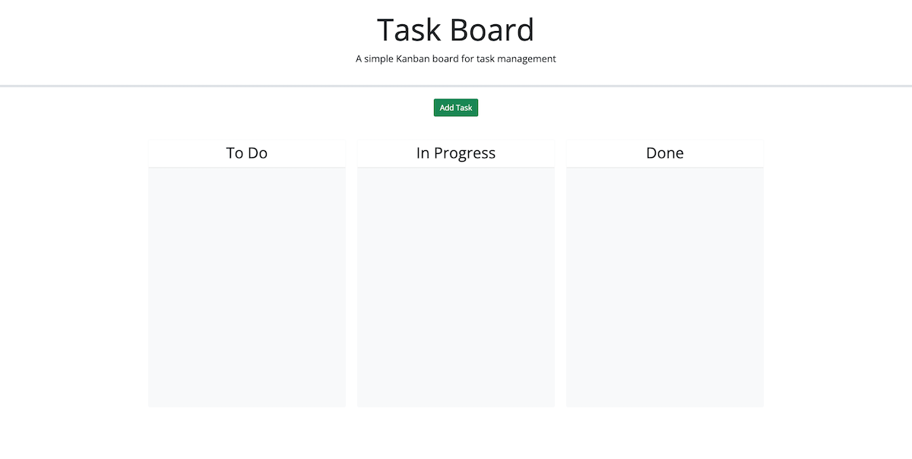
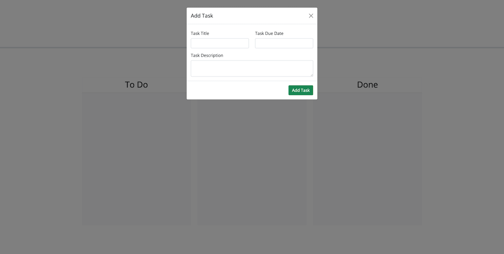
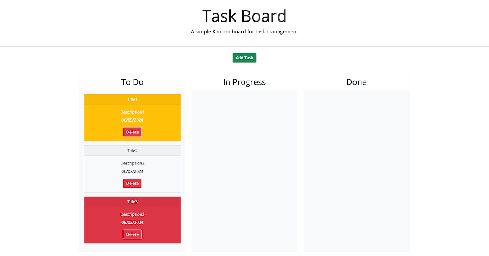

# TASK BOARD MANAGER

Welcome to the Task Board Manager! In this project, users can add individual project tasks, manage their state of progress and track overall project progress accordingly. Here's a guide on how to use the platform and its features.

## Features

Task Progress Tracking:

* Upon opening the task board, users will see a list of tasks displayed in columns representing different stages of progress: To Do, In Progress, and Done.

Task Creation:

* On clicking the add task button, a new task opens a modal dialog where users can enter the title, description, and deadline date for the new task.

Deadline Status Indication:

* Each task is color-coded to signify its deadline status. Tasks nearing the deadline are highlighted in yellow, while overdue tasks are marked in red to prioritize user's work efficiently.

Localstorage:

* When user save a new task, user inputs are stored in their browser's localStorage, ensuring that user's tasks remain saved even after closing the browser window.

Drag and Drop Functionality:

* User can update the progress state of a task by dragging and dropping it to a different column. The task's progress state is automatically updated and will remain in the new column even after refreshing the page.

Task Deletion:

* Users can easily remove the task from the task board by clicking the delete button. The deleted task will not reappear upon refreshing the page. 

Persistent Task Data:

* Upon refreshing the page, the saved tasks will persist, allowing users to resume their project management.

## Technologies used:

HTML, CSS, JavaScript, Bootstap, jQuery, jQuery UI, and Day.js

## Feedback and Contributions:

Feedback and Contributions are welcome! If you find any bugs or have suggestions for improvement, please open an issue or create a pull request.

## Webpage visual look:

[Live URL](https://sonusubedi-01.github.io/task-board)

[GitHub Repository](https://github.com/sonusubedi-01/task-board)

